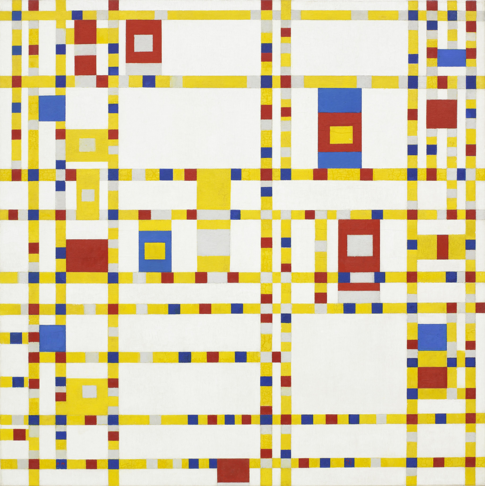
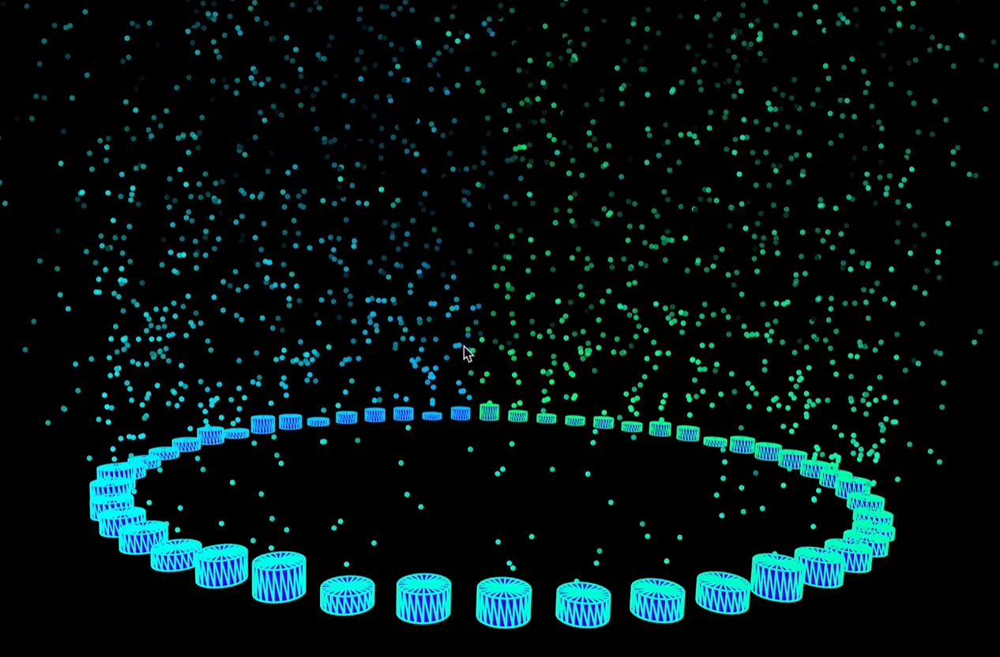

# hfan0348_9103_tut7
###### My design research for IDEA9103
# Final Project: Broadway Boogie Woogie (Piet Mondrian)

> New York, where Mondrian fled after the start of World War II, had a visible impact on his painting. He was inspired to rethink his work in his new context. Broadway Boogie Woogie, one of the last works he completed before his death, omits black and breaks his signature bars of color into multicolored segments. Bouncing against each other, the blocks of color in this painting create a pulsing rhythm, evincing a new dynamism in Mondrian’s work linked to his experience of New York and its jazz scene.(Broadway Boogie Woogie, 2011)
## My Design Work

### Part 1: Imaging Technique Inspiration
Our group chose Piet Mondrian’s Broadway Boogie Woogie. This work features strong color contrast and uses various sized blocks to divide the canvas. Although it’s static, it implies a strong sense of rhythm, so I wanted to express this hidden rhythm through music. Inspired by XORLAB’s audio visualization, which columns pulsate with sound and emit particles. I plan to animate block sizes with music. Since Broadway is a 2D image, 3D z-axis wouldn’t suit it. So I will apply the x/y-axis scaling from 9103 Week 10 to animate it with the beat.
- XORLAB: Tutorial on Interactive Audio Visualization Case Studies


[Link Text](https://www.bilibili.com/video/BV1tu411g7KN/?spm_id_from=333.1007.top_right_bar_window_history.content.click&vd_source=deead8168a18f5aee4de870f81972b36)

- IDEA9103 Week 10 Lecture

[Link Text](https://canvas.sydney.edu.au/courses/64347/pages/week-10-lecture?module_item_id=2585760)
### Part 2: Coding Technique Exploration
This section focuses on linking music to visual elements. Using FFT.waveform() to analyze amplitude over time and FFT.analyze() for frequency-domain data, I will map audio dynamics directly to block dimensions. By retrieving waveform[index] values, I use int() and map() to convert audio signals into meaningful visual sizes, setting block width and height accordingly. For particle effects, I adapted a loop-based system inspired by a p5.js sketch. With each frame, if a randomly generated value (random()) was lower than waveform[index], a new particle would be created. As amplitude increases, so does the particle count, while changes in block dimensions also influence particle speed—creating a rich, rhythm-responsive visual experience.

####
#####
###### 


**Bold Text** or _Bold Text_
*Italic Text*

- Item 1
- Item 2
  - Subitem 2.1
  - Subitem 2.2

1. First Item
2. Second Item
3. Third Item

[Link Text](https://www.google.com)


```
function helloWorld() {
console.log("Hello, world!");
}
```

> This is a blockquote.
